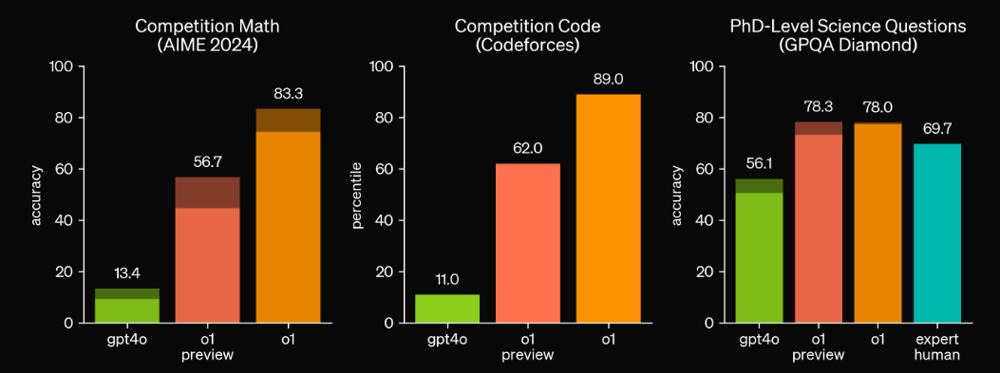
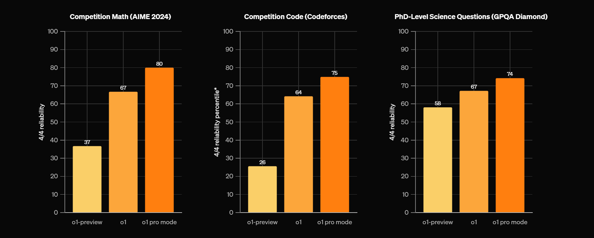
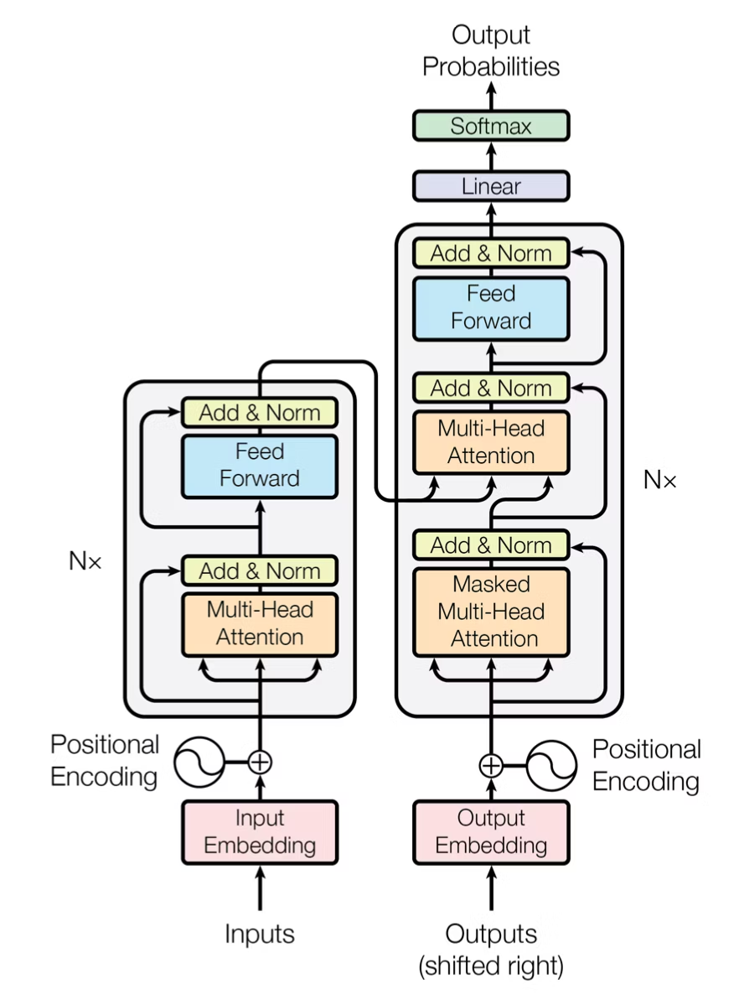
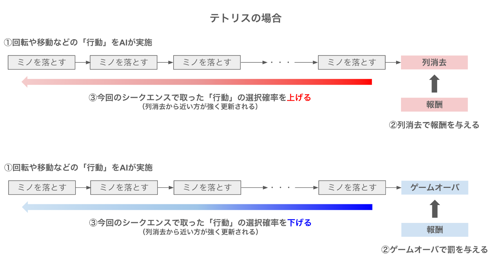
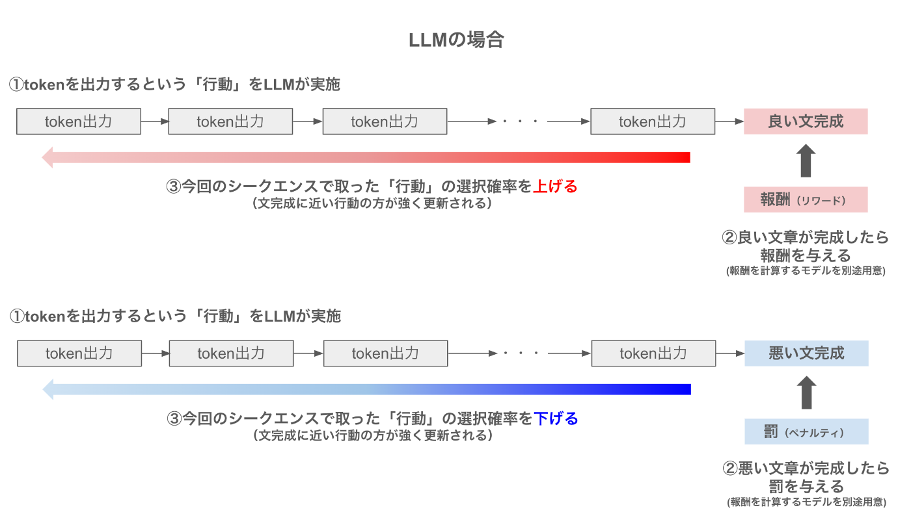

# 生成AIによるパラダイムシフト

## 1. イントロダクション

この講義では、2024年以降の生成AIの進化を概観し、それに基づいて私たちはこれからの時代に何を学ぶべきで、何を学ぶべきではないのかという点についてお話ししたいと思っています。そして、「**AIがこれほど賢くなった時代に、なぜ私たちは大学で学ぶ必要があるのか？**」について考えたいと思います。つまり、生成AIの登場以前に価値が高かった能力と、生成AIが高い能力を獲得しつつある今の時代で価値が向上する能力が変わりつつある転換点を迎えているというお話をします。そして、この講義を通じて、大学において学ぶことの意義がどのように変化していくかということについて理解を深めてもらえると嬉しいです。

2022年10月にChatGPTが発表されて以来、人と会話できるAIが生まれたことにとても驚きを覚えました。特に最初のうちはハルシネーションが多く見られましたが、ただ最初の大きな変化は「英語」への翻訳の意味では、従来のモデルと比較して圧倒的に優秀であり、「英語」学習の意味が問い直される必要がありました。

そのあと、ChatGPTからさまざまなサービスを利用するというPluginの利用ができるようになり、食べログなどの外部サービスとの連携が図られるようになりました。そして、2023年の中旬〜下旬になると、日本語能力も向上し、人間がテーマを与えるとそれについて代筆する程度のことは可能になりました。これにともなって、私たち教員は、生成AIを使って学生が書いたレポートをどう評価するのかという問いが与えられました。こと教育においては、生成AIの利用が学力の低下・思考力の低下を招くという懸念が大々的に報じられました。一方で、生成AIを利用することで事務的作業効率が向上したり、また生成AIを家庭教師のように使うことで以前よりも学力が伸びやすくなったという事例も報告されました。

そして、皆さんが部活や受験勉強を頑張っていた2024年は、生成AIの能力が飛躍した年です。知能レベルが劇的に向上し、医師国家試験に合格したり、薬剤師試験に合格するという国家試験レベルの問題にも対処できるだけの知識を持つようになります。この当時のAIは英語や国語の知識、文章問題に対する能力は高かったのですが、一方でSTEM領域の問題を解く能力はほとんどありませんでした。また、プログラミング能力も徐々に改善してはいましたが、まだまだ使い物にならないねという声がほとんどでした。私たち研究者の中にも、まだこの頃の生成AIの能力のイメージをひきづっていて、2025年の今の生成AIの実力を過小評価している人は多いです。

生成AIの能力値が爆発的に、非線形に向上したのは2024年の9月に発表された **Open AI o1-preview** と呼ばれる従来の生成AIのモデルが発表された以降の話です。このとき、何が起こったのかというと、生成AIが思考力を持ち始めたのです。思考するとは、文章を何度も精査してより良い文章を自分で作り直すようになったということです（後で説明します）。そして、この辺りからSTEM領域とプログラミング能力が、明らかに2024年9月以前と比べて飛躍的な差が生まれるようになりました。

この頃から、医師国家試験、薬剤師試験の成績は、合格か不合格かというレベルから、正答率がどこまで至れるかという別の次元の話へと引き上げられます。そして、徐々にSTEM領域の解凍能力が伸び始めます。そのあと、2024年12月 OpenAI o1 が発表され、同時に数学や物理、プログラミングに特化した推論ができる o1-pro が発表されました。この頃になると、2018年くらいの論文に書かれていることについて、ほとんど正確に答えられるようになりつつありました。そして高度なプログラムも書けるようになっています。そして、この機能を使い放題になる ChatGPT Pro が月200ドルのプランがリリースされました。また、同時期にClaudeにMCPが発表されており、ローカルな知識を活用した回答が生成できるシステムが実装されています。これはRAGと呼ばれる技術をClaudeが統合したと言えます。

2025年は、さらに大きな出来事として、DeepSeek が発表され、実はローカルマシーンでもOpenAI o1程度の力のあるLLMが動くようになりました。そして、2月には OpenAIが o3 モデルをリリースしました。そして、OpenAI Deep Research が発表されました。この機能は、専門家が1日や1週間かけて行う調査を、5分〜30分で完了させることができるものです。そして、内容について根拠資料をもって答えることができるという点で、非常に有用です。そして、2月25日にAnthropic から Claude 3.7 Sonnetが発表されました。情報をまとめ上げること、数学の計算、プログラミングどれをとっても、僕らよりもはるかに賢いAIです。

では、そんな時代が来た今、私たちは何を優先的に学び、何を捨てるべきでしょうか？大学において学ぶことの意義はなんでしょうか。それを理解するために、まずは今の生成AIの能力と、何ができるのかを正しく認識しましょう。

---

## 2. 2025年の生成AIの能力

生成AIによって何ができるのかという話をさまざまな角度からここでは見ていきましょう。まずは、生成AIの基盤技術である  **Transformer** と、生成AIに思考力を加えるための**強化学習**について紹介します。そのあとで、**現在の生成AIの能力**を事例を用いて紹介します。これら通して、正しい認識を獲得することを目標にします。

### 2.1 Transformer と 推論モデル

#### 2.1.1 **Transformer and Self-Attention Mechanism**
[Attention is all you need](https://arxiv.org/abs/1706.03762)という論文で提案された手法です。図にすると、こんな感じにの仕組みになります。これだけを見ても、なにこれ？って感じですよね。この中に使われている、Multi-head Attentionと呼ばれる機構が非常に重要な役割を果たしています。

一般的に私たちが文章を執筆することを想像してください。例えば「日本の人口ピラミッドの変化を考えた上で、医療費の負担の現状と今後について」というテーマについて文章を執筆しなさいという問題を考えましょう。その場合、執筆をするには何をしないといけないかというと、「**テーマを記憶**」しつつ、「**次に続く文章を予測**」して執筆する必要があります。この仕組みを実装しているのが、Transformerと呼ばれる仕組みです。そしてもう1つ重要なのは、人間が自然に行なっている「文章の意味理解」をどのようにしてコンピュータに行わせるのかという部分です。そこで重要なのが、この図のMulti-head attentionという部分になります。

機械と私たちの間にある本質的な違いというのは、文字とイメージが結びついているかどうかという部分です。しましまな模様＋ウマという足し算は、私たちの中ではしまうまになるでしょうが、機械にとっては全然わからないものです。そこで機械にこの能力を獲得させるためには、単語と単語の距離や関係性を学習させる必要があります。また、文章であれば並び順を考える必要もあります。さらに、次に続く文章を予測するためには、質問文のどこに大事な単語があるのか、それは他の単語とどう繋がっているのかを理解する必要があります。これを可能にしたのが、Multi-Head Attentionの仕組みです。

#### 2.1.2 **強化学習の統合**：
詳しい説明は、こちらの[解説記事](https://zenn.dev/asap/articles/34237ad87f8511)がとても参考になります。強化学習のイメージを捉えていただくために、こちらの図だけ引用します。

次の大きな問題は、生成した文章の良し悪しを評価していないということです。一度生成された文章を、生成AIが見直すことはありません。しかしそれだと、あくまでも確率に基づいた生成をしているので、嘘の情報や質の低い文章が生成されてしまいます。人間でも同じです。一回書いただけの文書を提出はしないでしょう。

人間が執筆する、または問題を解く際には、何度も見直しをして文章の前後関係を精査したりすることで文章の質を高めますよね。同様に生成AIもこれを行います。文章の質の良し悪しを計算することができるような価値判断をするAIを作ることで、生成された文章の良し悪しを判別させます。つまり、この価値判断をするというのは、プロンプト（指示文）＋生成AIが出力した文章を入力すると、点数づけをしてくれるようなAIだと思うとわかりやすいです。

そして、この文章の点数をつけるAIが、数学やプログラムなどに応じてさまざまなものを用意しておくと、数学やプログラム生成において、質問に対して十分に質の高い回答が得られるということになります。このような方法を用いて、強化された現在の生成AIの能力の高さを見てみましょう。

### 2.2 知識問題に対する解答力
[こちら](https://informa.medilink-study.com/web-informa/post45927.html/)のウェブサイトでは、2025年に実施された医師国家試験を、現在の生成AIに解かせて正答率を確認した結果が掲載されている。o3-mini-highによる得点は、必修の得点は上位10%程度で、一般臨床問題では第3位の成績に該当すると発表されています。

同様に、薬剤師国家試験についても2024年9月時点で[こちら](https://u-lab.my-pharm.ac.jp/~mminfo/blog/3554/)で情報が発表されましたが、o1-preview に解かせたところ正答率は100%だったとのことで、知識問題に対する正答率は十分であることがわかります。国家試験を受ける人は、これらのAIがどのように思考して解いているのかをトレースすることで正答率を上げることが可能かもしれません。

### 2.3 東大数学・京大数学に対する生成AIの能力
2011年からロボットは東京大学に入れるか？というプロジェクトが、日本の国立情報学研究所が中心になって実施されていました。2016年に大学入試センター試験、2021年に東大入試突破を目指してきていたのですが、2016年に凍結されてしまっています。その中でも最も難関だったのは数学であり、1問も正解できないというレベルでした。

今年、2025年の入試問題の数学ではどうだったのか？といえば、東京大学の数学の問題は大問が6つあり、それを5完半したという投稿がありました[リンク](https://x.com/kaitou_ryaku/status/1894453591735505353)。さらに、京都大学の問題は全ての問題を正解した（[リンク](https://x.com/issan_kyoto/status/1894587188886868258?t=rkQjOOMYQDwjDSvaEmevLA&s=19)）ということです。このことから、いよいよ与えられた問題を解くという力については、同世代の学生の上位1％には到達していることがわかりますよね（僕はそもそも5問も解ける自信がない...）。このことが示しているのは、**数学的に正しく与えられた問題について**は、生成AIは解くことができるようになったということです。

### 2.4 コードを書く能力
健康データサイエンスでは、スポーツ選手の動作分析や、リハビリテーションや介護の動作解析を行うという研究テーマを扱います。このような手法を、実際に自分でゼロからプログラムをするとなると、非常に困難でさまざまな知識が要求されるわけですが、私たちには強い味方である生成AIがあります。まずは、現在の生成AIのコードを書く能力を見てみましょう。

生成AIのコーディング能力を測るためのベンチマークとして、**SWE-bench** というものがあります。SWE-benchは実際のソフトウェア開発過程で発生する課題に対して、AIモデルの性能でどこまで対応できるかの測定を目的としており、以下の特徴があります。

- 実際のGitHub IssueとPull Request(現在は主にPythonに関連したPyPlパッケージ関連のリポジトリがターゲット)から抽出された現実的なタスク解決を試みる
- 単なるコード生成だけでなく、バグ修正や機能実装など多様なタスクを含む
- 自動評価システムによる客観的な性能測定

つまり現段階の最新大規模言語モデル(AI)が、　現代のリアルなアプリ開発やソフトウェアエンジニアリングの問題をどこまで人間と同じようにこなせるかを定量的に測ることを目的としたベンチマークスコアということです（[リンク](https://qiita.com/tosenbo/items/57ed6ded19da2b24d900)）。これにおいて Claude 3.7 Sonnet の能力は以下の結果からもわかるように非常に高く、これを踏まえると、現在の人間のエンジニアの上位1％よりも上に位置する可能性があるそうです。

ここから何が言えるのかというと、目的となるコードの方向性がわかっているなら、**自分が書かなくても、適切に制御さえすればAIが書いてくれる**ということです。

そこで、姿勢推定を行うタスクを claude 3.7 Sonnet を用いて自作してみた結果を示そうと思います（[Google Colab](https://colab.research.google.com/drive/1v4hvqWfp9_017v0meqT0OArB8tqq81q7?usp=sharing)）。姿勢推定には、mediapipeや、YOLOなどさまざまなモデルがあります。今回はmediapipeを使って、静止姿勢を撮影し、その結果から姿勢の状況を答えてくれるアプリケーションを開発します。

実はこの方法は、リアルタイムのデータにも応用できるため、動きを伴う動作の解析も可能です。例えば、左腕と右腕の可動域に差があるかどうかを検出したりできます。[こちら](https://claude.site/artifacts/b4c3b309-5d2c-4186-aa93-50f6c19c7459)は、claude 3.7 Sonnet で作成したインフォグラフィックです。

- **姿勢推定技術**：
  - コンピュータビジョンアーキテクチャ（PoseNet、AlphaPose、OpenPose）
  - 2Dと3Dのポーズ推定方法論とトレードオフ
  - 複雑な環境における複数人追跡アルゴリズム
  - リアルタイム性能最適化技術

- **スポーツへの応用**：
  - アスリートパフォーマンスにおける動作パターン分析
  - 生体力学的偏差からの傷害リスク評価
  - 即時フィードバックによるトレーニング技術の最適化
  - ケーススタディ：プロ野球の投球メカニクス、水泳のストローク分析
  
- **健康モニタリングシステム**：
  - 神経学的症状の早期発見のための歩行分析
  - リハビリテーション進行の定量化
  - 高齢者ケアのためのリモートモニタリングソリューション
  - 電子健康記録との統合
  
- **デモコンポーネント**：
  - 参加者の動作パターンのライブキャプチャと分析
  - 生体力学的指標の視覚化
  - 参照動作プロファイルとの比較
  - エラー検出と修正推奨

### 2.5 リサーチ能力

仕事や研究において大半の時間を使うと言っても過言ではないのは、先行事例調査と呼ばれる作業です。これは、何かを行うときに自分たちの方法が、どういう立ち位置なのかを明らかにする作業なのですが、これには非常に時間を取られます。また、大学・会社どんな組織でも、何か新しい取り組みをするというときには、他の会社はどういうふうにしているかを調査する必要があります。このような調査を実行する際には、わたしたちは google の窓や youtube の窓を叩きまくって調査してきました。

これは過去にも生成AIで取り組まれてきたことではあったのですが、そもそも情報がないものをあるかのようにうそぶいたりするために、文献調査をするのには適していないというのが一般認識だったのです。しかし、o3-mini-high に搭載された「Deep Research」は、この問題を解消しており、調査した結果の根拠をURLで提示したり、書籍を提示させたりできます。およそ人間が2時間〜3時間かかる作業を10分程度で行うことができるので、大幅な時間短縮を可能にしています。この機能は 2025年の2月にリリースされて、無料ユーザーは現在使用できませんが、今後は解放される可能性があるということです。

実際のレポートを確認してみましょう。今回は、順天堂大学健康データサイエンス学部について、Deep Research で評判を調査してみます。（[リンク](https://chatgpt.com/share/67c6d4fc-b284-800e-9b74-6867736f3167)）。

次に、この情報を加工します。ここでは、この結果を Claude 3.7 Sonnet に与えることで、綺麗に加工してみます（使うプロンプトは[こちら](https://x.com/hAru_mAki_ch/status/1896533569968984546)）。完成したものが[こちら](https://claude.site/artifacts/920e2af7-b99d-45bc-957e-b28863f9cde7)になります。情報からインフォグラフィックの作成まで、一気通貫に作成できてしまうのです。

### 2.6 RAG から Model Context Protocolへ
次に、2024年にできて注目したいのは、検索拡張生成（RAG）と呼ばれる技術と、Model context protocol (Anthropic) と呼ばれる技術です。特に、ここではMCPに注目します。一般的に大学や企業ではデータをオープンにしたくはないという問題があります。そこで、ローカルデータソースを用意して、それを参照してClaude に回答させるというシステムがMCPです（[こちら](https://www.ai-souken.com/article/claude-mcp-overview) の記事がわかりやすいので参照してください）。

[インフォグラフィック](https://claude.site/artifacts/58ea7607-ab9b-4bdc-ac06-3a655a9ce308)も用意しました。

## 3. 根本的なパラダイムシフト

ここまで見てきたように、生成AIは私たち人間が行ってきた多くの知的作業を代替、あるいは拡張できるようになっています。これを見ると『私たちは大学で何を学べばいいのか？』という疑問が生じるのは当然です。しかし、この技術革新は単に人間の仕事を奪うのではなく、私たちの役割を根本的に変えるパラダイムシフトを引き起こしています。この変化を理解することが、大学教育の新たな意義を見出す鍵となります。

まず私たちの人間社会の大原則について考えてみましょう。最も重要かつ根本的な原則は**AIがどれだけ進歩しようとも、AI出力に対する人間の責任はなくならない**ということです。この点が変化してしまったのなら、社会のルールは新しく考え直す必要があります。しかし、今の現状は、この原則が社会に適用されています。つまり人と社会では、いつでも結果の**正しさの検証と保証**を必要としています。だからこそ、人間が最後の結果が正しいことに責任を持ち補償をしないといけないのです。

そして、もう1つ重要な原則があります。問題というのは、どんなものでも**人が作る**ということです。数学で解きたい問題も、人間関係からくる悩み事も、スポーツが上達しないことも、病気が良くならないことも、何かに対して頑張れない自分が嫌になるもの、すべて人間が生み出している問題です。つまり、**何が問題なのか？**、**どの問題を解くのか**はAIが決めるものではなく、人間が決めることです。

生成AIはなんでもできます。たくさんの問題や困り事を解消できるかもしれません。しかし原則として、人間が解く問題を決めていて、人間が何をするかを責任を持って決するという前提があるのです。つまり、解決能力が高いAIがある現状においては、想定的に次の2つの重要性が相対的に大きくなります。

- **問題定義**：問題の範囲と制約の確立
- **出力検証**：解決策を意思決定し、それに対する責任を負う

そして、もう1つ気にしないといけない重要なことは、**世界にある問題はすべてAIが解ける形になっているのか？** ということです。答えは、**なっていない**のです。人間が感じた問題を解消するためには、次の2つの方法があります。

- 1. そのまま人間が解く
- 2. AIが解ける形に人間が整形する。

AIの力を引き出すためには、AIが解けるかたちに、AIが解くことをサポートできるかたちに問題を翻訳する必要があります。問題を解く能力が低い場合には、AIのために問題を解けるかたちに翻訳する必要はなかったですが、問題を解く能力が高くなってきた場合には、この能力が非常に大きな意味を持ちます。つまり、私たちに求められるもう1つの力は、問題をAIが解けるかたちに翻訳する力です。

- **問題翻訳** : 問題の本質を見抜き、AIが解ける形に持っていくこと

このパラダイムシフトによって、問題解決の流れは『問題定義→問題翻訳→AIで解決→出力検証』という新しいプロセスに変わります。これは単なる手順の変更ではなく、私たち人間に求められる能力の本質的な変化を意味します。では、この新しいプロセスの中で、どのような能力がこれからの時代に求められるのでしょうか？

## 4. 解く力から問う力へ：AIと共創する問題解決の新時代

### 4.1 従来の問題解決プロセスの限界

これまでの社会では、与えられた問題を「いかに早く」「いかに正確に」解くかという能力が重視されてきました。テストや入学試験、資格試験などはまさにその典型です。多くの企業でも、特定のタスクをこなす速さと正確さが評価の対象でした。

しかし、前章で見てきたように、現状の生成AIは医師国家試験や東大数学などの難問を解く能力において、すでに人間の上位1%程度の頭脳に匹敵します。これから発展していけば、大抵の人類よりも問題解決能力に優れる知能が、誰もが利用できるようになるでしょう。

このことは本質的な変化をもたらします。これまでは「答えを出す人」が価値を持っていましたが、これからは「問いを立てる人」「問題を定義する人」「AIの出力を評価できる人」に価値がシフトするのです。

#### 【具体例：データ分析プロジェクト】

**従来の方法：**
「この購買データを分析して、何か面白い傾向を見つけてください」
→ データサイエンティストが何日もかけてデータを探索、可視化し、いくつかの洞察を得る

**AIの時代：**
「この小売店の購買データから、天候と購買パターンの関連性、特に雨天時の商品カテゴリ別の売上変動を分析してください」
→ AIが数分で基本分析を実行、人間はその結果を精査し、「なぜ雨の日に特定商品の売上が上がるのか」「見落としている要因はないか」を考察

### 4.2 AIとの協働による新しい問題解決サイクル

生成AIの登場により、問題解決のプロセスは根本的に変わります。従来は一つの問題を解いて終わりでしたが、生成AIはほぼリアルタイムに解答を生成できるため、複数回の試行が可能になります。

#### AIとの問題解決サイクル：

1. **問題の認識**（人間）：現実世界の状況から「ここに課題がある」と気づく
2. **問題の定義と形式化**（人間）：AIが解ける形に問題を整理・翻訳する
3. **初期解析・解答生成**（AI）：問題に対する解答や分析を生成
4. **結果の評価と問題の再定義**（人間）：AIの出力を評価し、問題を精緻化する
5. **詳細解析・解答の改善**（AI）：精緻化された問題に対して再度解答
6. **最終評価と意思決定**（人間）：複数の解答から最適な選択をする
7. **実装と検証**（人間とAI）：実際に適用して結果を確認する

→ 新たな問題の認識へ

このサイクルを高速に回転させることが、これからの問題解決の鍵となります。かつては同僚や上司との対話で行っていたこのプロセスが、生成AIとの対話に置き換わるのです。

#### 【具体例：健康データの分析】

大学のスポーツ科学研究でフィットネストラッカーのデータを分析する場合：

**従来（サイクルが遅い）**：
1. データを集める（数週間）
2. 分析方法を決める（数日）
3. 分析を実行（数日）
4. 結果を解釈（数日）
5. 報告書作成（数日）
→ 全体で1〜2ヶ月

**AIとの協働（サイクルが速い）**：
1. データを集める（同じく数週間）
2. 初期分析方針をAIと議論（数時間）
3. AIが複数の分析案を提示（数分）
4. 人間が評価し方向性を修正（数時間）
5. AIが詳細分析を実行（数分）
6. 人間が結果を解釈・評価（数時間）
7. AIが報告書の草案を作成（数分）
8. 人間が最終調整（数時間）
→ データ収集後は1〜2日で完了

このように、AIとの協働により問題解決のサイクルが劇的に高速化され、より多くの試行錯誤が可能になります。

### 4.3 問題定義能力と精査能力の重要性

このような時代において、特に重要になるのが「問題定義能力」と「AIの出力を精査する能力」です。

#### 問題定義能力の3つのレベル：

1. **基本レベル**：「健康データがあるから何か分析したい」
   - あいまいで方向性がない。AIは広範な提案をするが焦点がない。

2. **具体化レベル**：「20代の大学生の睡眠パターンと学業成績の関係を分析したい」
   - 対象と目的が明確。AIはより具体的な分析ができる。

3. **解析可能レベル**：「20代大学生100名の1ヶ月間の睡眠データ（睡眠時間、質、中断回数）と期末試験成績の相関分析を行い、特に睡眠の質が試験前日と1週間前でどのように影響するかを重回帰分析で検証したい」
   - AIが最適な手法で分析できる形に翻訳されている。

問題を明確に定義する能力は、AIからの出力の質を根本的に左右します。曖昧な問題設定からは曖昧な回答しか得られません。

#### AI出力の精査能力：

AIが生み出した解答や分析結果を評価するための重要なポイント：

1. **論理的一貫性**：結論に至る推論過程に飛躍や矛盾はないか
2. **データ適合性**：使用されたデータやサンプルサイズは問題に適切か
3. **仮定の妥当性**：分析の前提条件は現実的か
4. **結果の解釈**：統計的有意性と実務的重要性を区別できているか
5. **代替説明**：他の解釈の可能性を検討しているか

#### 【具体例：睡眠と学習効率の分析】

AIが「睡眠時間と学習効率には強い正の相関がある」と結論付けた場合の精査：

**不十分な精査**：
「AIが言っているから正しいだろう」→ 結論をそのまま受け入れる

**適切な精査**：
- サンプルサイズは十分か？（30人では少ない）
- 交絡因子は考慮されているか？（例：カフェイン摂取、ストレスレベル）
- 因果関係と相関関係の区別はついているか？
- 個人差は考慮されているか？（短時間睡眠でも効率的に学習できる人もいる）
- データの収集方法は信頼できるか？（自己申告vs客観的測定）

この精査能力があるかないかで、AIとの協働の質が大きく変わります。そして、この能力を養うためには、データサイエンスの基礎知識が不可欠なのです。

### 4.4 データサイエンス学部で磨くべき能力

データサイエンス学部の学生として特に注目すべきは、AIの時代におけるデータサイエンティストの役割の変化です。

#### データサイエンティストの役割の変化：
- **従来**：「データの収集・整理・分析・可視化」が主な仕事
- **これから**：「問題定義・仮説構築・AI出力の検証・意思決定支援」がコアの価値に

これからのデータサイエンティストに求められる能力は：

1. **領域知識と数理的思考の融合**：
   - 医療、スポーツ、ビジネスなど特定分野の知識と、数学・統計の知識を組み合わせる力
   - 例：「この運動パターンデータから怪我のリスクを予測するには、どの変数が重要か」を判断できる

2. **統計的な批判的思考**：
   - データの分布、バイアス、因果関係と相関関係の区別を理解する力
   - 例：「このAIモデルが示す関係性は、サンプリングバイアスによる見せかけの相関ではないか」を判断できる

3. **問題の数理的表現力**：
   前章で示した例のように、現実の問題を数学的・統計的に表現する力
   - 「医療費の負担増加」→「年齢層別医療費支出の時系列分析と将来推計」
   - 「健康増進効果」→「介入前後のバイオマーカー変化の統計的検定」

4. **実験設計能力**：
   - AIの予測や分析結果を検証するための実験を設計する力
   - 例：「このAIが予測する運動効果を検証するには、どのような対照実験が必要か」

これらの能力は、AIが問題を解く能力が高まるほど、相対的に価値が増していきます。なぜなら、AIは与えられた問題は解けても、「何を問題とすべきか」「どう検証すべきか」を自ら判断することはできないからです。

### 4.5 新時代の問題解決者になるために

生成AIの時代に必要なのは、AIと協働して問題を解決する「問題解決のアーキテクト」としての能力です。そのために大学で学ぶべきことは：

1. **基礎知識の習得**：
   - 数学・統計学の基礎概念
   - データ分析の方法論
   - 専門領域（健康科学など）の知識
   
   これらは問題を定義し、AIの出力を評価するための「物差し」となります。

2. **批判的思考の訓練**：
   - 論理的に議論を分析する
   - 仮説を立て検証する
   - 多角的に問題を見る
   
   これらはAIの出力を鵜呑みにせず、適切に評価するために必要です。

3. **問題設定の練習**：
   - あいまいな状況から問題を明確化する
   - 大きな問題を小さな問いに分解する
   - AIが解ける形に問題を翻訳する
   
   これらは生成AIの能力を最大限に引き出すために不可欠です。

重要なのは、これらの能力は「AIを使わずに全部自分でやる」ことで身につくわけではないということです。むしろ、AIと協働しながら、その出力を評価し、問題を再定義するサイクルを繰り返すことで磨かれていきます。

大学での学びは、単にツールの使い方を覚えることではなく、AIと共に問題を解決していくための知的基盤を築くプロセスなのです。この知的基盤があってこそ、皆さんは「AIの言うことを鵜呑みにする人」ではなく、「AIを使いこなす問題解決者」になることができるのです。

## 5. 生成AI時代の大学教育：問う力を育む知的基盤の構築

ここまで見てきたように、生成AIの登場によって私たちの問題解決のあり方は根本的に変わりつつあります。「解く力」は生成AIに任せられる一方で、「問う力」「検証する力」がより重要になっています。では、この変化を踏まえて、大学で学ぶことの意義とは何でしょうか？そして、皆さんがこれから4年間で身につけるべき能力は何なのでしょうか？

### 5.1 知識の新たな価値：問うための基盤として

従来の教育観では「知識を身につける」ことが重視されてきました。しかし、スマートフォンやインターネットの普及により、「知っていること」の価値は相対的に低下していると言われてきました。

しかし、生成AIの時代において、実は**知識の価値は大きく高まっている**と言えます。なぜなら：

1. **問題を定義するための前提**：
   良い問いを立てるためには、その分野の基本概念や課題を理解している必要があります。例えば、健康データを分析する際、「心拍変動」や「活動量」などの基本概念を理解していなければ、適切な問いを立てることはできません。

2. **AIの出力を評価するための物差し**：
   AIの回答が正しいかどうかを判断するためには、その分野の基礎知識が不可欠です。例えば、AIが「この統計分析の結果から、介入効果は有意である」と言ったとき、その判断が正しいかを評価するには統計学の基礎知識が必要です。

3. **領域を横断する思考の基盤**：
   異なる分野の知識を組み合わせて新しい問いを立てることは、AIにはまだ難しい人間ならではの能力です。例えば、心理学の知見とウェアラブルデバイスの技術を組み合わせた新しい健康増進アプローチを構想するには、両方の分野の知識が必要です。

このように、知識は単なる「答え」ではなく、「問いを生み出す源泉」「AIとの対話を深める基盤」として、新たな価値を持つようになっています。

#### 【具体例：健康データサイエンスでの知識の活用】

生成AIに「運動と健康の関係を分析してください」と指示した場合：

**知識がない学生の場合**：
- 漠然とした指示しかできない
- AIの回答（「有酸素運動は心血管系の健康に良い」など）を鵜呑みにするしかない
- 分析の深掘りができない

**知識がある学生の場合**：
- 「30代女性の週3回の高強度インターバルトレーニングが、安静時心拍数と睡眠効率に与える6週間の効果を分析してください。特に、トレーニング時間帯（朝vs夕方）による差異に注目して」など具体的な指示ができる
- AIの回答に対して「この分析では交絡因子として栄養摂取状況を考慮すべきでは？」といった適切な質問ができる
- 「この結果と近年の筋トレによるマイオカインの研究を関連付けると、どのような仮説が立てられますか？」など、分析を深掘りできる

### 5.2 生成AI時代に大学で培う本質的な力

最後に、生成AI時代に大学教育で培うべき本質的な力についてまとめましょう。

#### 1. 深い文脈理解力

表面的な情報だけでなく、その背景にある理論や歴史、社会的文脈を理解する力です。AIは情報を処理できますが、その意味を深く理解するのは人間の役割です。例えば、健康データの変動が単なる数値変化ではなく、生活習慣の変化や社会環境の影響を反映していることを理解できるのは、文脈を把握する人間の力です。

#### 2. 領域横断的な統合力

異なる分野の知識を有機的に結びつけ、新しい視点を生み出す力です。例えば、スポーツ科学の知見と行動経済学の理論を組み合わせて、より効果的な健康増進プログラムを設計するといった思考ができるようになります。

#### 3. 知的謙虚さと批判的思考力

自分の知識の限界を理解し、常に検証する姿勢を持つことです。AIの回答に対しても、自分の考えに対しても、「本当にそうなのか？」と問い続ける習慣が重要です。知識が増えるほど「わからないこと」が増えることを理解し、学び続ける謙虚さが必要です。

#### 4. 創造的な問題設定力

既存の枠組みにとらわれず、新しい問いを立てる力です。「こんな分析はできないだろうか」「この現象の背後にはどんなメカニズムがあるのだろうか」といった好奇心から生まれる問いが、イノベーションの源泉となります。

### 5.3 結論：AIと共に成長する知的冒険者になる

生成AIの時代に大学で学ぶ意義は、単にスキルや知識を身につけることではなく、「問う力」を持った知的冒険者になることにあります。常に好奇心を持ち、深く考え、AIと対話しながら自らの思考を深めていく。そして、その過程で得た知見を社会に還元していく。

皆さんには、生成AIを道具として使いこなしながら、人間にしかできない「問い」を立て続けることを期待しています。大学での4年間は、その知的冒険の第一歩です。AIが解答を提供する時代だからこそ、より良い問いを立てられる人になるための貴重な時間として活用してください。

最後に、この講義の内容を一言でまとめるなら：**「AIが答えを出す時代には、より良い問いを立てる人が世界を変える」**ということです。皆さんがそのような「問いの力」を持った人材に成長されることを願っています。