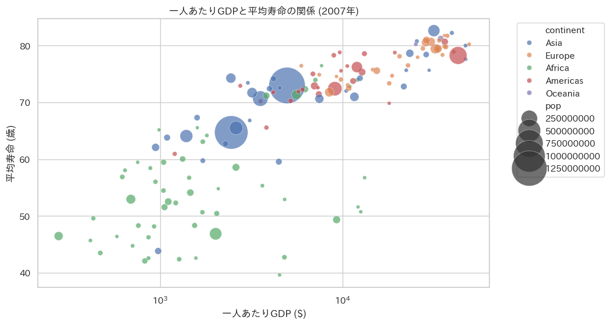
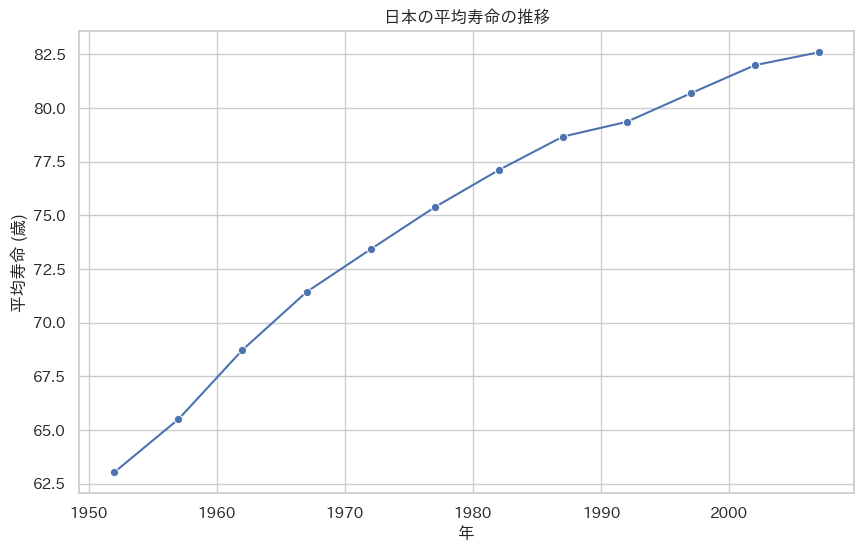
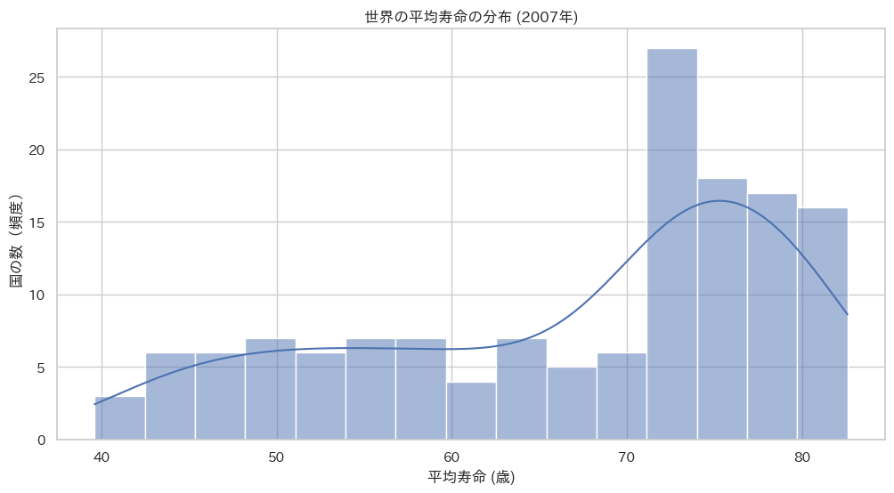
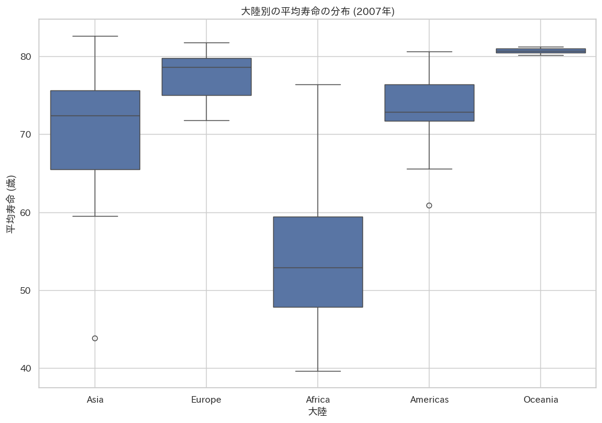
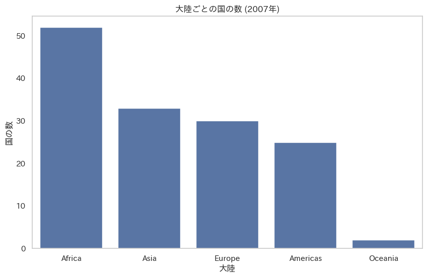
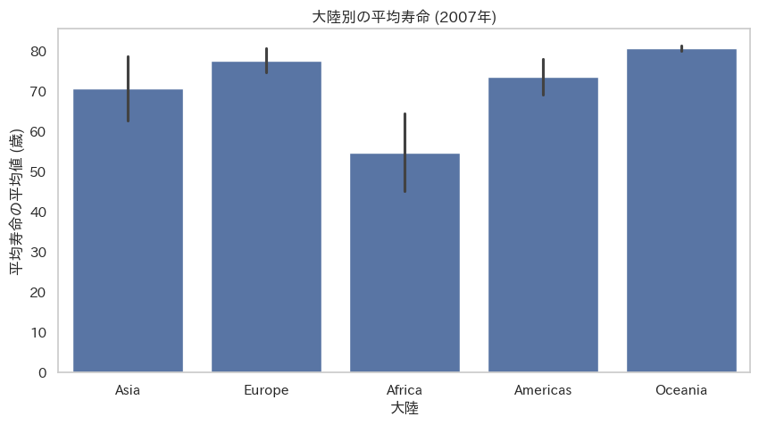

<!-- header: 'T. Nakamura | Juntendo Univ.' -->
<!-- footer: '2025/02/08' -->
<style>
section { 
    font-size: 20px; 
}
img[alt~="center"] {
  display: block;
  margin: 0 auto;
}
/* ページ番号 */
section::after {
    content: attr(data-marpit-pagination) ' / ' attr(data-marpit-pagination-total);
    fonr-size: 60%;
}
/* 発表会名 */
header {
    width: 100%;
    position: absolute;
    top: unset;
    bottom: 21px;
    left: 0;
    text-align: center;
    font-size: 60%;
}
/* 日付 */
footer {
    text-align: center;
    font-size: 15px;
}
</style>


<!--
_class: lead
_paginate: false
-->


# データサイエンス入門
## データの理解と可視化
---

## はじめに：データ分析とデータ理解

* データ分析プロジェクトの最初の重要なステップ = **データの理解**
* データの特徴、変数間の関係性を把握する
    * 適切な分析手法の選択
    * 意味のある洞察の獲得
* データ理解の基本手法
    * **記述統計量の確認**
    * **データの可視化（グラフ作成）**

---

## 本日の学習目標

1.  データセットの基本的な情報を把握する（記述統計量、データ型など）。
2.  目的別に適切なグラフを選択し、作成できるようになる。
    * 散布図 (Scatterplot)
    * 折れ線グラフ (Linegraph)
    * ヒストグラム (Histogram)
    * 箱ひげ図 (Boxplot)
    * 棒グラフ (Barplot)
3.  作成したグラフからデータの傾向やパターンを読み取る基本的な視点を養う。

---

## 使用ツール

* **Google Colaboratory (Colab):** クラウドベースの Python 実行環境
* **Python:** プログラミング言語
* **ライブラリ:**
    * `gapminder`: データセットを提供
    * `pandas`: データ操作・分析の基本ライブラリ
    * `matplotlib`: グラフ描画ライブラリ
    * `seaborn`: `matplotlib` をベースにした、より美しいグラフを簡単に描画できるライブラリ
    * `japanize-matplotlib`: 日本語表示用（オプション）

---

## 1. 環境設定：ライブラリのインストール

Google Colab のノートブックで、まず必要なライブラリをインストールします。

```python
# Gapminder データセットをインストール
!pip install gapminder

# 日本語表示のための設定（オプション）
!pip install japanize-matplotlib
````

-----

## 1\. 環境設定：ライブラリのインポート

次に、使用するライブラリをインポートします。

```python
import pandas as pd
from gapminder import gapminder # データセット本体
import matplotlib.pyplot as plt
import seaborn as sns
import japanize_matplotlib # 日本語表示用

# Seaborn のスタイル設定（見やすいように）
sns.set_style('darkgrid')
```

-----

## 2\. データ準備：Gapminderデータの読み込み

`gapminder` データセットを `pandas` の DataFrame として読み込みます。

```python
# データの読み込み
df = gapminder

# これで df という変数にデータが格納されました
```

-----

## 2\. データのサマリー把握（導入）

グラフ作成の前に、データセットの基本的な情報を確認します。

  * どんなデータが入っているか？ (`head()`)
  * データ型や欠損値は？ (`info()`)
  * 数値データの基本的な統計量は？ (`describe()`)
  * カテゴリデータの種類と数は？ (`value_counts()`)

-----

## 2\. データの一部を確認: `head()`

データの最初の数行を表示して、実際のデータ内容を確認します。

```python
# データの最初の5行を表示
print(df.head())
```

**実行結果（例）：**

```
       country continent  year  lifeExp       pop   gdpPercap
0  Afghanistan      Asia  1952   28.801   8425333  779.445314
1  Afghanistan      Asia  1957   30.332   9240934  820.853030
2  Afghanistan      Asia  1962   31.997  10267083  853.100710
3  Afghanistan      Asia  1967   34.020  11537966  836.197138
4  Afghanistan      Asia  1972   36.088  13079460  739.981106
```

  * 国名、大陸、年、平均寿命、人口、一人あたりGDP の列があることがわかります。

-----

## 2\. データの基本情報を確認: `info()`

各列のデータ型、行数、欠損値の有無などを確認します。

```python
# データフレームの情報を表示
df.info()
```

**実行結果（一部）：**

```
<class 'pandas.core.frame.DataFrame'>
RangeIndex: 1704 entries, 0 to 1703
Data columns (total 6 columns):
 #   Column     Non-Null Count  Dtype
---  ------     --------------  -----
 0   country    1704 non-null   object
 1   continent  1704 non-null   object
 2   year       1704 non-null   int64
 3   lifeExp    1704 non-null   float64
 4   pop        1704 non-null   int64
 5   gdpPercap  1704 non-null   float64
dtypes: float64(2), int64(2), object(2)
memory usage: 80.0+ KB
```

  * 1704行 x 6列のデータ
  * 欠損値 (Non-Null Count) はない
  * データ型 (Dtype): `object`(文字列), `int64`(整数), `float64`(浮動小数点数)

-----

## 2\. 記述統計量を確認: `describe()`

数値データ列の基本的な統計量（平均、標準偏差、最小値、最大値など）を確認します。

```python
# 数値列の記述統計量を表示
print(df.describe())
```

**実行結果（一部）：**

```
              year      lifeExp           pop     gdpPercap
count  1704.000000  1704.000000  1.704000e+03   1704.000000
mean   1979.500000    59.474439  2.960121e+07   7215.327081
std      17.265330    12.917107  1.061579e+08   9857.454543
min    1952.000000    23.599000  6.001100e+04    241.165876
25%    1965.750000    48.198000  2.793664e+06   1202.060309
50%    1979.500000    60.712500  7.023596e+06   3531.846988
75%    1993.250000    70.845500  1.958522e+07   9325.462346
max    2007.000000    82.603000  1.318683e+09  113523.132900
```

  * 各数値データの分布の概要（中心、ばらつき、範囲）を把握できます。
  * `lifeExp` は約23.6歳〜82.6歳、`gdpPercap` は約$241〜$113,523 と、大きな幅があることがわかります。

-----

## 2\. カテゴリ変数を確認: `value_counts()`

カテゴリデータ（ここでは `continent` と `country`）に含まれる項目とその件数を確認します。

```python
# 大陸ごとのデータ数
print("--- 大陸ごとのデータ数 ---")
print(df['continent'].value_counts())

# 国ごとのデータ数（上位5件）
print("\n--- 国ごとのデータ数 (上位5件) ---")
print(df['country'].value_counts().head())
```

**実行結果（一部）：**

```
--- 大陸ごとのデータ数 ---
Africa      624
Asia        396
Europe      360
Americas    300
Oceania      24
Name: continent, dtype: int64

--- 国ごとのデータ数 (上位5件) ---
Afghanistan    12
Pakistan       12
Nepal          12
Netherlands    12
New Zealand    12
Name: country, dtype: int64
```

-----

## 3\. 作図によるデータの理解（導入）

**なぜグラフを描くのか？**

  * **直感的な理解:** 数値の羅列だけでは分かりにくいパターンや傾向を視覚的に捉える。
  * **関係性の発見:** 変数間の相関や異常値（外れ値）などを発見しやすくする。
  * **伝達力の向上:** 分析結果を他者に分かりやすく伝える。

これから、代表的なグラフを Gapminder データで作成していきます。

-----

## 3\. 作図によるデータの理解：グラフの種類

今回は以下の5種類のグラフを作成します。

1.  **散布図 (Scatterplot):** 2つの数値変数の関係
2.  **折れ線グラフ (Linegraph):** 時系列変化
3.  **ヒストグラム (Histogram):** 1つの数値変数の分布
4.  **箱ひげ図 (Boxplot):** カテゴリごとの数値変数の分布比較
5.  **棒グラフ (Barplot):** カテゴリごとの頻度や集計値比較

-----

## 3.1 散布図 (Scatterplot)：目的

**目的:** 2つの**数値変数**の関係性を視覚化する。

  * **正の相関:** 一方が増えるともう一方も増える傾向
  * **負の相関:** 一方が増えるともう一方が減る傾向
  * **無相関:** 特に関係が見られない
  * **外れ値:** 他のデータ点から大きく外れた点
    などを確認できます。

**例:** 一人あたりGDP (`gdpPercap`) と平均寿命 (`lifeExp`) の関係

-----

## 3.1 散布図 (Scatterplot)：コード例（準備）

2007年のデータに絞って見てみましょう。

```python
# 2007年のデータのみ抽出
df_2007 = df[df['year'] == 2007].copy() # .copy() をつけて SettingWithCopyWarning を回避
```

`seaborn.scatterplot` を使用します。大陸ごとに色分けし、人口を点のサイズで表現します。

```python
plt.figure(figsize=(10, 6)) # グラフサイズ
sns.scatterplot(data=df_2007, x='gdpPercap', y='lifeExp',
                hue='continent', size='pop', sizes=(20, 1000), alpha=0.7)
plt.title('一人あたりGDPと平均寿命の関係 (2007年)')
plt.xlabel('一人あたりGDP ($)')
plt.ylabel('平均寿命 (歳)')
plt.xscale('log') # X軸を対数スケールに
plt.legend(bbox_to_anchor=(1.03, 1), loc='upper left') # 凡例を外に
plt.grid(True)
plt.show()
```


-----

## 3.1 散布図 (Scatterplot)：解釈のポイント



  * **全体的な傾向:** 右肩上がりの分布 👉 **正の相関** (GDPが高いほど寿命も長い傾向)
  * **X軸の対数スケール:** GDPが低い国の分布が見やすくなる。
  * **色 (hue):** 大陸ごとの分布の違い（例：アフリカは左下に多い）
  * **サイズ (size):** 人口規模（例：中国やインドが大きい点で示される）

-----

## 3.2 折れ線グラフ (Line graph)：目的

**目的:** 時間の経過など、**順序のある変数**に対する**数値変数**の変化を追跡する。

  * 時系列データのトレンド（上昇、下降、横ばい）
  * 周期性や季節性
    などを把握するのに適しています。

-----

## 3.2 折れ線グラフ (Line graph)：コード例（準備）

**例:** 日本 (`Japan`) の平均寿命 (`lifeExp`) の推移

日本のデータのみを抽出します。

```python
# 日本のデータのみ抽出
df_japan = df[df['country'] == 'Japan'].copy()
```

`seaborn.lineplot` を使用します。

```python
plt.figure(figsize=(10, 6))
sns.lineplot(data=df_japan, x='year', y='lifeExp', marker='o') # marker='o'で点を表示
plt.title('日本の平均寿命の推移')
plt.xlabel('年')
plt.ylabel('平均寿命 (歳)')
plt.ylim(65, 85) # Y軸の範囲を調整して変化を分かりやすく
plt.grid(True)
plt.show()
```

-----

## 3.2 折れ線グラフ (Line graph)：解釈のポイント




  * **トレンド:** 一貫して右肩上がりに上昇している。
  * **変化:** 線の傾きから、伸びが大きい時期と緩やかな時期があることがわかる。
  * 特定の年の値も読み取れる。

-----

## 3.3 ヒストグラム (Histogram)：目的

**目的:** 1つの**数値変数**の**分布**（どのような値がどのくらいの頻度で出現するか）を視覚化する。

  * データがどの範囲に集中しているか
  * 分布の形状（山がいくつあるか、左右対称か、歪んでいるか）
    などを把握します。

**例:** 2007年における世界の国々の平均寿命 (`lifeExp`) の分布

`seaborn.histplot` を使用します。（`df_2007` を使用）

```python
plt.figure(figsize=(10, 6))
sns.histplot(data=df_2007, x='lifeExp', kde=True, bins=15) # kde=Trueで密度曲線も表示
plt.title('世界の平均寿命の分布 (2007年)')
plt.xlabel('平均寿命 (歳)')
plt.ylabel('国の数（頻度）')
plt.grid(True)
plt.show()
```

-----

## 3.3 ヒストグラム (Histogram)：解釈のポイント



  * **集中:** 70歳代後半の国が最も多い。
  * **形状:**
      * 低い寿命（40歳代）の国も一定数存在する。
      * 二つの山（二峰性）があるように見える（先進国と途上国の差を示唆？）。
  * **KDE:** 滑らかな曲線で分布の全体像を把握しやすい。
  * **bins:** 棒の数を変えると見え方が変わるので注意。

-----

## 3.4 箱ひげ図 (Boxplot)：目的

**目的:** **カテゴリ変数**の各水準（グループ）ごとに、**数値変数**の分布を比較する。

  * 中央値（分布の中心）
  * 四分位範囲（データのばらつき）
  * 外れ値
    を簡潔に表現し、グループ間の違いを把握するのに役立ちます。

**例:** 大陸 (`continent`) ごとの平均寿命 (`lifeExp`) の分布比較 (2007年)

`seaborn.boxplot` を使用します。（`df_2007` を使用）

```python
plt.figure(figsize=(12, 7))
sns.boxplot(data=df_2007, x='continent', y='lifeExp')
plt.title('大陸別の平均寿命の分布 (2007年)')
plt.xlabel('大陸')
plt.ylabel('平均寿命 (歳)')
plt.grid(True)
plt.show()
```

-----

## 3.4 箱ひげ図 (Boxplot)：コード例（Seaborn）



-----

## 3.4 箱ひげ図 (Boxplot)：解釈のポイント

  * **箱:**
      * 中の線 = **中央値**
      * 箱の上端/下端 = 第3/第1四分位数
      * 箱の長さ = 四分位範囲 (IQR) = データのばらつき
  * **ひげ:** 箱から伸びる線 (通常はIQRの1.5倍の範囲内)
  * **点:** 外れ値
  * **比較:**
      * ヨーロッパ、オセアニアは中央値が高く、分布も高い位置にある。
      * アフリカは中央値が低く、ばらつきも大きい。
      * アジア、アメリカは中間的。

-----

## 3.5 棒グラフ (Barplot)：目的

**目的:** **カテゴリ変数**の各項目（カテゴリ）の\*\*頻度（数）**や、カテゴリごとの**数値変数の集計値（平均値、合計値など）\*\*を比較する。

  * カテゴリ間の量の違いを明確にする。

**例1:** 各大陸に含まれる国の数（頻度）
**例2:** 各大陸の平均寿命の平均値

`seaborn.countplot` を使用して、カテゴリごとのデータ数を表示します。（`df_2007` を使用）

```python
plt.figure(figsize=(10, 6))
# order で頻度順に並び替え
sns.countplot(data=df_2007, x='continent', order=df_2007['continent'].value_counts().index)
plt.title('大陸ごとの国の数 (2007年)')
plt.xlabel('大陸')
plt.ylabel('国の数')
plt.grid(axis='y') # Y軸方向のグリッド線
plt.show()
```

-----

## 3.5 棒グラフ (Barplot) 例1：頻度（解釈）



  * 各大陸にデータが存在する国の数を比較できます。
  * アフリカの国数が最も多く、次いでアジア、ヨーロッパの順であることがわかります。
  * `value_counts()` の結果をグラフにしたものと同じです。

-----

## 3.5 棒グラフ (Barplot) 例2：集計値（コード例）

`seaborn.barplot` を使用して、カテゴリごとの平均値を表示します。（`df_2007` を使用）

*(デフォルトで平均値を計算。エラーバーは信頼区間を示す)*

```python
plt.figure(figsize=(10, 6))
# ci='sd' でエラーバーを標準偏差にすることも可能
sns.barplot(data=df_2007, x='continent', y='lifeExp')
plt.title('大陸別の平均寿命 (2007年)')
plt.xlabel('大陸')
plt.ylabel('平均寿命の平均値 (歳)')
plt.grid(axis='y')
plt.show()
```

-----

## 3.5 棒グラフ (Barplot) 例2：集計値（解釈）



  * 棒の高さが各大陸の**平均寿命の平均値**を示します。
  * エラーバーはデータのばらつき（デフォルトでは信頼区間）を示します。
  * オセアニアとヨーロッパの平均寿命が特に高く、アフリカが著しく低いことが明確にわかります。
  * 箱ひげ図で見た分布の傾向（中央値の比較）と整合しています。

-----

## 4\. まとめ：各グラフの使い分け

| グラフ種類     | 主な目的                                       | 変数の種類                         |
| :------------- | :--------------------------------------------- | :--------------------------------- |
| **散布図** | 2つの数値変数の関係性（相関、外れ値）を見る    | 数値 vs 数値                     |
| **折れ線グラフ** | 順序のある変数（時間など）に対する変化を見る | 順序・時間 vs 数値               |
| **ヒストグラム** | 1つの数値変数の分布（頻度、形状）を見る      | 数値                             |
| **箱ひげ図** | カテゴリごとに数値変数の分布を比較する       | カテゴリ vs 数値 (分布比較)      |
| **棒グラフ** | カテゴリごとの頻度や集計値（平均等）を比較する | カテゴリ vs 数値 (集計値・頻度) |

-----

## 4\. まとめ：可視化の重要性

  * **データ理解の深化:** 数値だけでは見えないパターンや関係性を直感的に把握できる。
  * **洞察の発見:** 外れ値や予期せぬ傾向を発見する手がかりになる。
  * **分析方針の決定:** データの特性に合わせた分析手法を選択する助けになる。
  * **効果的な伝達:** 分析結果やインサイトを分かりやすく他者に伝える強力なツール。

➡️ **データ分析において、可視化は必須のスキルです！**

-----

## 5\. 今後の学習

  * 今回学んだグラフの**カスタマイズ**
      * 色、ラベル、タイトル、凡例、サイズ調整
      * 複数のグラフの組み合わせ (subplot)
  * **`seaborn` の他の高度なグラフ**
      * ペアプロット (`pairplot`): 変数間の関係性を一覧表示
      * ヒートマップ (`heatmap`): 相関行列などの可視化
      * バイオリンプロット (`violinplot`): 箱ひげ図と密度推定を組み合わせ
  * **統計的な視点**との組み合わせ
  * **インタラクティブな可視化**ライブラリ (`plotly`, `bokeh`)

-----

## 6. 演習問題

**前提:**
以下のコードが実行され、`gapminder` データが `DataFrame` として変数 `df` に読み込まれているものとします。

```python
import pandas as pd
from gapminder import gapminder
import matplotlib.pyplot as plt
import seaborn as sns
import japanize_matplotlib # 日本語表示用（インストール済みとする）

# Seaborn のスタイル設定
sns.set_style('darkgrid')

# データの読み込み
df = gapminder
```

---

**問題1：[ヒストグラム] 2007年の一人あたりGDPの分布**

2007年における世界各国の「一人あたりGDP (`gdpPercap`)」は、どのような分布になっているでしょうか？ ヒストグラムを作成して確認してください。横軸（一人あたりGDP）は対数スケール (`plt.xscale('log')` や `sns.histplot` の `log_scale=True`）にすると、分布の特徴がより明確になるかもしれません。

**目的:** 特定の年の経済指標（一人あたりGDP）が、どの範囲に集中しているか、どのような形状の分布をしているかを視覚的に把握する。

---

**問題2：[折れ線グラフ] アフリカ大陸の平均寿命の推移**

アフリカ大陸 (`continent == 'Africa'`) に属する国々の平均寿命 (`lifeExp`) は、1952年から2007年にかけてどのように変化してきたでしょうか？ 各年におけるアフリカ大陸全体の**平均寿命の平均値**を計算し、その推移を折れ線グラフで示してください。

**目的:** 特定の地域（アフリカ大陸）における健康指標（平均寿命）の長期的なトレンドを視覚化する。

---

**問題3：[散布図] 人口と一人あたりGDPの関係の変化（1952年 vs 2007年）**

国の経済力（一人あたりGDP）と人口規模 (`pop`) の間には、どのような関係があるでしょうか？ また、その関係は時代によって変化したでしょうか？ 1952年と2007年のそれぞれについて、横軸に一人あたりGDP (`gdpPercap`)、縦軸に人口 (`pop`) をとった散布図を作成し、比較してください。両方の軸を対数スケールにすると見やすくなります。
（ヒント：2つのグラフを別々に描画するか、`hue` オプションを使って1つのグラフに年ごとの違いを色で表現する方法があります。）

**目的:** 2つの数値変数（人口、一人あたりGDP）の関係性を、異なる2つの時点で比較し、その変化を捉える。

---

**問題4：[箱ひげ図] アメリカ大陸とアジア大陸のGDP分布比較 (2007年)**

2007年において、アメリカ大陸 (`Americas`) とアジア大陸 (`Asia`) の国々では、一人あたりGDP (`gdpPercap`) の分布にどのような違いがあるでしょうか？ これら2つの大陸のデータを抽出し、大陸ごとに一人あたりGDPの分布を比較できる箱ひげ図を作成してください。縦軸（一人あたりGDP）は対数スケール (`plt.yscale('log')` や `sns.boxplot` の `log_scale=True`) にすると比較しやすくなるでしょう。

**目的:** 特定のカテゴリグループ（アメリカ大陸 vs アジア大陸）間で、数値変数（一人あたりGDP）の分布の中心（中央値）、ばらつき（四分位範囲）、外れ値を比較する。

---

**問題5：[棒グラフ] 各大陸の総人口 (2007年)**

2007年時点での、各大陸の人口 (`pop`) の**合計値**はどのようになっているでしょうか？ 大陸ごとに人口の合計値を計算し、その結果を棒グラフで比較してください。どのグラフが最も多くの人口を抱えているか、視覚的に分かりやすく示しましょう。

**目的:** カテゴリ（大陸）ごとに数値変数（人口）の合計値を算出し、その大きさを棒グラフで比較する。

---

### 今日の授業がここまで