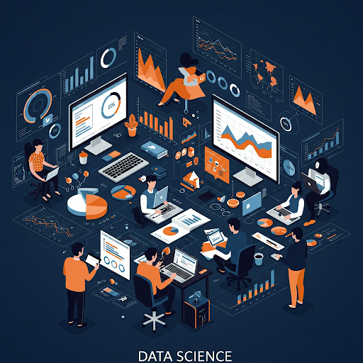

<!-- header: 'T. Nakamura | Juntendo Univ.' -->
<!-- footer: '2025/02/08' -->

<!--
_class: lead
_paginate: false
-->

# Health Data Science Website Redesign Contest: How to Create a Compelling Proposal

ver 1.00
Department of Health Data Science
2025.05.03
Tomoshige Nakamura

---

## 第1章 ウェブ制作の基礎 - コンペ理解とウェブサイトの目的設定 

- データサイエンスにおいて重要なことは、「データを分析する」ということだけではない。
- データの分析とは「**データ分析の結果に基づいて、誰かの問題を解決する**」ことである。
- そのための基本技術には次のようなものがある
    - 顧客や対象の理想の把握
    - データの収集による現状の把握
    - 顧客の理想と現実のギャップの本質の特定
    - 課題を解決するアイデアとその届け方の構築
    - 提案書の作成

- この授業ではデータサイエンスの基礎的な技術を扱うがそれだけでは実践的な訓練は行えない。
- HDSが実施するWebサイト改革コンテストへの参加を行ってもらいます。

---

## 授業における評価とのリンク

- この課題を、期末課題の1つとする。
- 第2回の7月4日（金）の期限に事務室への提出を行なってもらいます。
- 個人で提出すること。チームを組んでの提出は認めない。

#### 課題の評価
- この課題は、全体評価の 40% とする。40%のうち、事務室への期限内の提出を行えば**20点**。さらに提出した内容の評価によって**20点**満点で評価。
- 提案した内容が、1次審査を通過し、最終プレゼンテーションを行った場合に上記とは他に **15点** を加点する。
- 最終プレゼンテーションの結果、賞を獲得した場合には評点をさらに上記とは他に **15点** 加点する

---

## 1.1 はじめに 

### 1.1.1 コンペの概要 
- **目的**: 健康データサイエンス学部の魅力を伝え、**志願者を増やす**ための「ホームページ」アイデアを学生視点で提案 。
- **スケジュール**:
    - 企画案提出(PPT→PDF): 第1回 5/20(火), 第2回 7/4(金)
    - 第一次審査発表: 第1回 5/24(土), 第2回 7/12(土) 
    - 最終プレゼン審査会(対面): 7月中旬以降調整中 
- **提出物**: PPT企画資料(PDF形式)、5枚程度(6-7枚許容)、メール提出 。
- **審査基準**: テーマ理解、独自性、視覚表現、実現可能性、発表スキル(最終審査) 。

---

### 1.1.2 学生視点の重要性 
- ターゲット（受験生・保護者）への共感力の高さを期待 。
- 自身の高校生時代の視点（「こんなサイトが見たかった」）からニーズを掘り下げ、共感を呼ぶ提案を 。

### 1.1.3 レクチャー全体の流れ 
- ウェブサイト制作の「ゴールデンスタンダード」を解説 。
- 全6章構成、まずは第3章までを理解し、コンテンツを考える 。3.5章で提案資料作成方法を解説 。
- 第4章以降はより専門的（サイトマップ、UX等）、挑戦者向け 。
- **構成**:
    - 1章: 強み把握、目標設定、ターゲット (本章) 
    - 2章: ユーザー理解 (ペルソナ、共感マップ、ジャーニー) 
    - 3章: 現状分析 (サイト診断、競合調査) 
    - 3.5章: 提案資料作成 （ウェブコンテンツ提案） 
    - 4章: 戦略立案 (コンセプト、コンテンツ戦略、IA) 
    - 5章: 具現化 (UX/UI、ビジュアル、ワイヤーフレーム) 
    - 6章: 提案と発表 (企画書、プレゼン) 

---

## 1.2 「学部の魅力」の多角的ブレインストーミング 

- 学部の魅力となりうる要素を幅広く洗い出す (質より量) 。
- **視点例**:
    - **学問・研究**: 分野の将来性、カリキュラム特色(PBL)、研究テーマ、教員、設備 。
    - **学生生活**: キャンパス、施設、サークル、留学、サポート体制 。
    - **キャリア・将来**: 就職先、卒業生事例、インターン、資格、社会連携 。
    - **環境・その他**: 大学ブランド、学費/奨学金、入試、新しさ 。
- **アウトプット例**: 医療現場に近い、PBL、専門科目早期開始、PC設備、キャンパス立地、就職サポート、新しい学部、著名教授、AI/機械学習 。

---

## 1.3 魅力からウェブサイトの目標を作る 

- ウェブサイトは目的を持つコミュニケーションツール 。
- **役割**: 情報提供、ブランディング、興味喚起、関係構築、行動促進 。
- 魅力を伝え、ユーザーにどのような行動/意識変化を促したいか「目標」を設定 。
- **SMART原則**:
    - Specific (具体的) 
    - Measurable (測定可能) - KPI例: PV、滞在時間、直帰率、CVR、CTR 
    - Achievable (達成可能) 
    - Relevant (関連性) 
    - Time-bound (期限) 
- **アウトプット例**: 「研究紹介」→「オープンキャンパス」ページ遷移率をX%からY%に向上 (3ヶ月以内) 。

---

## 1.4 ターゲットオーディエンス設定 

- 「誰に」情報を届けるかを明確にする 。
- **主要ターゲット**: 受験生、保護者 。
- ターゲットのニーズ、興味関心、**知識レベル**に合わせてコンテンツ、表現、デザインを最適化 。
- **受験生**: 高校生。学び、キャンパスライフ、将来に関心。情報源はWeb/SNS(スマホ中心)、OC重視。友人/親/先生の影響 。
- **保護者**: 子供の意思決定に影響力大。学費/奨学金、就職実績、安全性、評判に関心。情報源はWeb、説明会、口コミ。PC/スマホ利用 。
- 注意点: 両者の視点/ニーズの違い、海外志願者の考慮 [cite: 1, 3]。
- **二次的ターゲット**: 高校教員、在学生、卒業生、企業、地域住民 (焦点は主要ターゲットに) [cite: 1, 3]。
- **アウトプット例**: 受験生ペルソナ(高2女子)、保護者ペルソナ(40代母)の概要設定 。

---

## 第2章 ユーザー理解 - ペルソナ、共感マップ、カスタマージャーニー 

ターゲットオーディエンスを深く具体的に理解するための手法（ユーザー中心設計の根幹） 。

---

## 2.1 ターゲットオーディエンス分析の深化 

- **情報収集行動の具体化**: いつ、どこで、どのように情報を探すか？信頼する情報源は？ 
    - 例: 高校生は高2秋からスマホでSNS検索、公式サイトブックマーク、OC後にPCで再訪 。保護者は子供との会話や説明会を機にPCで学費/就職実績をチェック 。
- **意思決定プロセスと影響要因の特定**: 認知→興味→情報収集→比較検討→参加→出願→合格→入学決定の各段階でウェブサイトの役割は異なる 。何を重視するか？ペインポイント（悩み/不安）とゲイン（期待/欲求）は何か？ 

---

## 2.2 ペルソナ設定 

- ターゲットを代表する架空の人物像を作成 。
- **目的**: 「誰向けか」を明確化、チーム内の共通認識醸成、アイデア創出、意思決定基準 。
- **要素**: 基本情報、顔写真、パーソナリティ/価値観、ITスキル、大学選びのゴール、課題/悩み(ペインポイント)、印象的なセリフ、デジタル行動、影響者/情報源 。
- 最低限、受験生と保護者のペルソナを各1人作成 。
- **アウトプット例**: 受験生ペルソナ「中村 未来」の概要 。

---

## 2.3 共感マップ作成 

- ペルソナの視点に深く共感するためのツール 。特定状況下でのペルソナの内面・外面を可視化 。
- **6つの要素**:
    - See (見ているもの): Webサイトのデザイン、情報、周囲の環境 。
    - Hear (聞いていること): 周囲からのアドバイス、評判、口コミ、音声情報 。
    - Think & Feel (考えていること・感じていること): 最重要。思考（面白そう、難しそう等）や感情（期待、不安等） 。
    - Say & Do (言動): 実際の言葉や行動（話す、クリック、メモ、相談等） 。
    - Pain (痛み・ストレス): 不満、障害、困難（情報が見つからない、理解できない、不安等） 。
    - Gain (得たいもの): 達成したいこと、利益、欲求（分かりやすい情報、疑問解消、期待感、安心感等） 。
- **目的**: ペルソナのインサイト発見、ウェブサイト改善アイデア創出 。
- **アウトプット例**: 中村未来が初めて学部サイトを見た時のThink & Feel, Pain, Gain 。

---

## 2.4 カスタマージャーニーマップ作成 

- ユーザー体験全体を時間軸で整理し俯瞰するツール 。認知からアクションまでのプロセスを可視化 。
- **目的**: 体験全体を把握、行動/思考/感情/タッチポイントの変化を明確化、課題（ペインポイント）特定、ウェブサイトの役割と他チャネル連携を戦略的に考える 。
- **構成要素 (横軸: ステージ、縦軸: 行動等)**:
    - ステージ: 認知、興味・関心、情報収集、比較検討、行動、入学準備等 。
    - ユーザーの行動: 各ステージでの具体的行動 。
    - タッチポイント: 行動が起こる場所/媒体（SNS、検索、サイト、OC等） 。
    - 思考・感情: 各ステージでの思考や感情の変化（共感マップ活用） 。
    - 課題・機会: 問題点（ペインポイント）と改善/アピールのチャンス 。
- **効果**: 重要なタッチポイントや課題ステージを特定し、改善策を講じることが可能 。
- **アウトプット例**: 中村未来のジャーニーマップ一部（興味・関心～行動段階） 。

---

## 第3章 現状分析 - サイト診断、競合・先進事例調査、分析ツールの活用 

現状の学部ウェブサイトの状態を客観的かつ多角的に把握し、強み・弱み・機会・脅威を明らかにする 。

---

## 3.1 現状ウェブサイトの詳細分析 (ヒューリスティック評価 & データ分析) 

- 対象サイト (https://www.juntendo.ac.jp/academics/faculty/hds/) をペルソナになりきって操作評価 。専門的観点（ヒューリスティック評価）も用いる 。
- **目的**: 強み(Keep)/弱み(Problem)/改善提案(Try)を洗い出す 。
- **分析観点**:
    - ユーザビリティ: 学習容易性、効率性、記憶容易性、エラー防止/回復、主観的満足度 。
    - ナビゲーション & IA: 構造の論理性、ラベルの適切性、一貫性、発見可能性、サイト内検索 。
    - コンテンツ: ニーズ適合性、魅力伝達度、最新性/正確性、多様な形式 。
    - ビジュアル & ブランディング: 信頼感、学部らしさ表現、質、一貫性 。
    - モバイル最適化: 表示崩れ、操作性、文字/ボタンサイズ、速度 。
    - CTA & コンバージョン: 行動喚起の明確性/発見容易性、導線 。
    - SEO基礎: title/description、キーワード、内部リンク 。
- **データ分析 (可能なら)**: Google Analytics等でアクセス数、流入経路、人気ページ、離脱箇所、検索キーワードを確認 。
- **アウトプット例**: サイト診断結果の一部 (Keep/Problem/Try) 。

---

## 3.2 競合・先進事例調査 

- 市場での立ち位置把握、他からの学び、差別化のため調査・分析 。
- **調査対象**:
    - **直接競合**: 国内外の類似学部を持つ大学サイト（併願校、高評価校） 。
    - **間接競合/参考事例**: ターゲット層が近い他教育機関、優れた異業種サイト（デザイン、UI/UX、コンテンツ、技術活用）、海外先進大学サイト 。
- **比較分析観点**: 現状サイト分析観点に加え、
    - ターゲットへの訴求方法: キャッチコピー、ビジュアル、ストーリーテリング 。
    - コンテンツ戦略: 独自コンテンツ、目的 。
    - デザイン・テクノロジー: トレンド、採用技術 。
    - 情報構造とナビゲーション: 構成の優劣 。
    - 差別化要因: 独自の強みや特徴の打ち出し方 。
- **記録**: 「どの点が」「なぜ」優れているか、「自サイトにどう応用できそうか」。比較表（マトリクス）やスクショ活用 。
- **アウトプット例**: 競合サイト分析メモの一部（〇〇大学 データ科学部） 。

---

## 3.3 分析結果の整理とインサイト抽出 

- 現状分析と競合調査の結果を整理し、本質的な課題や改善方向性（インサイト）を抽出 。戦略立案への橋渡し 。
- **プロセス**:
    - 分析結果共有と議論（課題は？強み/弱みは？ターゲット視点では？学べる点は？） 。
    - 課題、機会、強み、弱みで整理（SWOT分析も有効） 。
    - 単なる事実列挙でなく、意味や次のアクションへの示唆（インサイト）を導出 。
- **例**: 「現状サイトは専門的で魅力が伝わりにくい（弱み）。競合は動画等で親近感を醸成（脅威）。→分かりやすい表現と共感を呼ぶコンテンツ強化が必要（機会/方向性）」 。
- これらのインサイトが次章以降の土台となる 。
- **アウトプット例**: インサイト抽出メモ (3点) [cite: 6, 7]。

---

## 第3.5章 魅力的なウェブコンテンツの提案と資料作成 

分析から得たインサイトに基づき、学部の魅力を最大限に引き出し、ターゲットに響く「魅力的なウェブコンテンツ」を考案し、提案資料にまとめる 。

---

## 3.5.1 分析からコンテンツアイデアへ：インサイトの活用 

- **学部の「魅力」を伝えるコンテンツ (第1章より)**:
    - 例: 「医療現場との近さ」→連携事例紹介記事/動画 。
    - 例: 「PBL」→プロセスを追うドキュメンタリー風動画/記事 。
    - 例: 「著名な教員」→研究への情熱やメッセージを語るインタビュー動画 。
- **ユーザーの「ニーズ」に応えるコンテンツ (第2章より)**:
    - 例: ペイン「難しそう」→Help「先輩解説！基礎のキソ」動画、「文系出身/数学苦手でも大丈夫？」Q&A記事 。
    - 例: ゲイン「活躍したい」→Hub 卒業生インタビュー「HDS卒業生は今」 。
    - 例: ジャーニー「興味・関心」→Hero 学部魅力ダイジェスト動画 。
- **現状の「ギャップ」を埋めるコンテンツ (第3章より)**:
    - 例: 弱み「キャンパスライフが伝わりにくい」→「360°バーチャルツアー」、「#HDSの日常 VLOG」 。
    - 例: 競合の強み「インタラクティブな学び紹介」→「研究室診断チャート」、「インタラクティブ・カリキュラムMAP」 。
    - 例: 機会「保護者の不安解消」→保護者向け専用セクション「学費・奨学金まるわかりガイド」等 。

---

## 3.5.2 魅力を最大化するコンテンツ形式 

- ターゲットやメッセージに合わせ最適な表現形式を選択 。
- **形式例**:
    - テキスト (詳細情報、Q&A、記事) 
    - 画像・イラスト (高品質写真、図解) 
    - 動画 (リアルな雰囲気、ストーリー性) - YouTube活用 
    - インフォグラフィック (データ可視化) 
    - インタラクティブ要素 (診断、マップ、シミュレーション) 
- **考慮点**: モバイル閲覧、視覚的魅力、ストーリーテリング [cite: 7, 8]。

---

## 3.5.3 コンテンツ提案資料の作成ポイント 

- **要件**: PPT→PDF、5枚程度 。
- **構成例**:
    - 1枚目: 表紙・コンセプトサマリー 
    - 1枚目後半 or 2枚目: キーインサイト（提案根拠） 
    - 2～4枚目: ★具体的なコンテンツ提案（中心部分、具体例詳述） 
    - 5枚目: まとめ 
- **★具体的なコンテンツ提案の記述例 (2～3つに絞る)**:
    - コンテンツ名
    - ターゲット
    - 目的・ゴール
    - 内容概要
    - 表現形式
    - なぜ魅力的か（提案根拠: ニーズ、課題、競合比較）
    - (イメージ図: ワイヤーフレームやモックアップ推奨) 
- **提案例**:
    - 1: 在学生 VLOG「#HDS Hack My Life」 (縦型ショート動画) 
    - 2: インタラクティブ・コンテンツ「未来発見！HDSナビ」 (学びマップ、研究室診断) 
    - 3: 保護者向け安心ハブ「HDSサポートナビ」 (情報集約ページ) 

---

## 3.5.4 説得力のある提案のために 

- **質重視**: 効果が見込める質の高いアイデアを厳選 。
- **根拠を示す**: 分析結果（ペルソナ、課題、競合）と結びつける 。
- **具体的に描く**: 内容や見せ方を詳しく記述、ビジュアル活用推奨 。
- **独自性を意識**: 学部ならでは、学生視点ならではの切り口を盛り込む 。